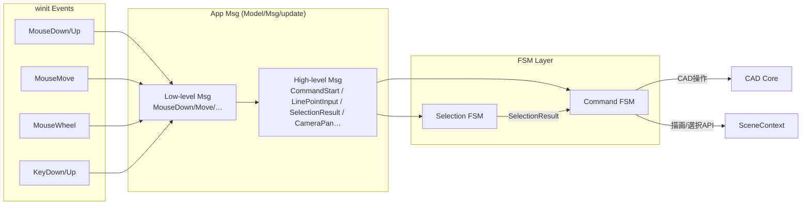

# App Interactions — Msg / FSM / SceneContext Flow

本書は UI/App 層でのイベント処理フローを定義する。
- winitイベント
  → Appの `Msg`
  → Selection FSM / Command FSM
  → CADコア / SceneContext / HTTP コマンドサーバ

## 1️⃣ Msg レイヤ

- 低レベル入力Msg (winit由来)
  - `MouseDown { button, pos }`
  - `MouseUp { button, pos }`
  - `MouseMove { pos }`
  - `MouseWheel { delta, pos }`
  - `KeyDown { key }`, `KeyUp { key }`

- 高レベルMsg (アプリ内部)
  - `CommandStart(CommandKind)`
  - `CommandFinish`
  - `CommandCancel`
  - `SelectionResult { hit: Option<ElementId> }`
  - `LinePointInput(Point3)` など、各コマンドFSM向けの入力
  - `CameraPan { delta }`, `CameraZoom { factor, pivot }`

低レベル入力 → 高レベルMsg への変換は update の「前段」または専用の変換レイヤで行う。

## 2️⃣ クリックルーティング — Selection vs Command

- `tool_state` により、クリックをどこへ渡すかを決める。

- 作図系ツールがアクティブな場合（例: Line/Polyline/Circle）:
  - `MouseDown(Left, pos)`
    1. snap + pick を用いてスクリーン座標からワールド座標 `Point3` を決定
    2. Command FSM へ `LinePointInput(Point3)` などのイベントとして渡す
  - Selection FSM はこの時点では動かさず、「線作図中のクリック＝点入力」に専念させる。

- 選択モード / 編集コマンド前段階の場合:
  - `MouseDown(Left, pos)`
    1. snap + pick で `Option<EntityId>` を取得
    2. CADコアのマッピング `EntityId → (ElementId, FaceId?, EdgeId?)` を使って Selection FSM を進める
    3. SceneContext に `Select(on/off)` や `Highlight(on/off)` を送る
  - Command FSM は SelectionResult を前提に動く（Move なら SelectionDone → BasePoint入力へ進む）。

この方針により:
- Selection FSM は「どの要素が選ばれているか」を管理する責務
- Command FSM は「ツールの入力状態（点・距離・角度など）」を管理する責務
を保ったまま、クリックのルーティングだけを tool_state で切り替える。

## 3️⃣ pick API と実装戦略

SceneContext に「画面座標→EntityId」を取得する高レベルAPIを用意する:

- `pick(screen_pos: Vec2) -> Option<EntityId>`
  - v0: CPUベースのピッキング
    - CameraParams を用いてスクリーン→ワールドレイを計算
    - 内部に保持するジオメトリ（線/円など）との距離で最小の EntityId を決定
  - v1: GPUベースのピッキング
    - オフスクリーンIDバッファに EntityId をエンコードして描画
    - クリック位置のピクセルを読み出し、EntityId を復元

App/UI層は `pick` API の存在だけを前提とし、CPU/GPU の詳細には依存しない。内部実装はレンダリングコア側で段階的に切り替える。

## 4️⃣ EntityId → ElementId/TopoId マッピング

- CADコア側で、次のマッピングテーブルを管理する:
  - `EntityId -> ElementId`
  - 必要に応じて `EntityId -> (ElementId, FaceId?, EdgeId?)`
- SceneContext はあくまで描画用の EntityId しか知らない。
- Selection/Command FSM は:
  1. pick で EntityId を得る
  2. CADコアのマップから ElementId/TopoId に変換
  3. Selection状態やCAD操作を更新
  4. 最後に SceneContext に Select/Highlight/Display を行う

責務分担:
- SceneContext: 描画とピック（EntityIdまで）
- CADコア: 意味のある要素ID（ElementId/FaceId/EdgeId）と履歴
- App/UI: MsgとFSMをつなぐ「オーケストレーション層」

## 5️⃣ Pan / Zoom と Msg

- Pan:
  - `MouseDown(Middle or Space+Left)` → `Msg::PanStart { pos }`
  - `MouseMove` 中 → `Msg::PanMove { delta }`
  - `MouseUp` or キー解除 → `Msg::PanEnd`
  - update 内で `view_state.camera` を更新し、次の描画で CameraParams を SceneContext.render に渡す。

- Zoom:
  - `MouseWheel { delta, pos }` → `Msg::CameraZoom { factor, pivot }`
  - pivot はカーソル位置に応じて決める。update 内で `view_state.camera` を更新。

Pan/Zoom は CommandActive 中でも許可し、Undo/Redo の対象外とする。

