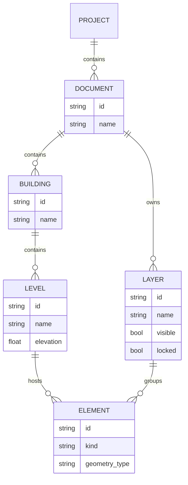

# CAD Core Architecture Overview — Architectural CAD (BIM-ready, not BIM-first)

## Purpose
- 建築CADコアの「どう作るか」を定義する設計書。
- 要件定義 (`docs/requirements/cad-core.md`) を、モジュール構成・データ構造・レイヤ構造に落とし込む。

## Layering
- App/UI 層 (Elmアーキテクチャ)
  - Model/Msg/update/view。
  - CADコアとレンダリングコアを統治するが、幾何詳細は持たない。
- CAD Core 層 (本書の対象)
  - ドキュメント、建物、レベル、グリッド、要素(壁/床/屋根/柱/梁/開口など)とそのトポロジ・履歴を管理。
  - f64ベースの幾何/トポロジモデル。
- Rendering Core 層
  - SceneContext/API/Dirty/VisualFlags に従って描画を担う。
  - CADコアから `KernelShape` としてメッシュ/ポリラインを受け取る。

## Core Concepts
- Document: 1つ以上の Building を含む論理ドキュメント。
- Building: レベル・グリッド・要素集合のコンテナ。
- Level: 高さ(Z)と名称を持つ水平なレイヤ。壁/床/柱などが属する。
- Grid: 軸線(X/Y方向)と通り番号を持つ、レイアウトの基準。
- Element: 壁/床/屋根/柱/梁/開口などの建築要素。BRep/CSG/Sketchは内部表現。
- Relation: 接続(柱–梁の接合など)や依存(開口–壁)を表す関係。

## IDs and Referencing
- DocumentId, BuildingId, LevelId, GridId, ElementId, FaceId, EdgeId, VertexId 等の安定IDを導入する。
- Renderingの EntityId とは別空間とし、マッピングテーブルで関連付ける。
- IDは原則再利用しない（削除後は墓場扱い）。

### EntityId マッピング
- CADコアはレンダリング用の EntityId との対応を持つ:
  - `EntityId -> ElementId`
  - 必要に応じて `EntityId -> (ElementId, FaceId?, EdgeId?)`
- SceneContext は EntityId をキーに描画状態のみ管理し、Element/Face/Edge の意味は知らない。
- Selection/Commandは、pickで得たEntityIdからこのマップを参照し、CADコア側の要素状態を更新する。

## Data Separation
- **Semantic vs Geometric（段階的に拡張）**
  - Semantic: 壁タイプ/用途/部屋/構造種別など建築属性。現段階では最小限（タイプ・材質・厚み・高さなど）に絞り、BIM的な詳細属性は別レイヤとして後付け可能にする。
  - Geometric: BRep/CSG/Sketch による形状。f64で保持。
  - レンダリングには `KernelShape` を介して f32 Mesh/Polyline を渡す。

## Operations (High-Level)
- 要素作成: 壁/床/柱/梁/開口をグリッド/レベル基準で生成（これが最小スコープ）。
- 要素編集: 移動/回転/伸縮、タイプ変更、開口の追加・削除。
- トポロジ編集: BRep レベルのブーリアン/フィレット等は「拡張」。初期スコープ外。
- 履歴・Undo/Redo: 操作単位で履歴を残す。フィーチャツリー化は将来拡張。

### Undo/Redo 戦略
- CADコアは Element/Component への変更を「差分ログ」として記録する:
  - 追加: `old=None, new=Element`
  - 削除: `old=Element, new=None`
  - 更新: `old=旧値, new=新値`（例: Transform, プロパティ）
- 1つのユーザーコマンド(Line/Move/Trim等)は、複数Diffの束として履歴に積む。
- Undo は Diff を逆順に適用し、Redo は順方向に再適用する。
- Rendering Core(SceneContext/SceneWorld)は Undo/Redo を直接扱わず、CADコア状態の変更に応じて Dirty→sync で再構築する。

## Integration with Rendering Core
- 各 Element は 1つ以上の `KernelShape` を通じて Rendering Core に形状を提供する。
- 選択/ハイライトは、EntityId → ElementId → (必要なら FaceId/EdgeId) のパスで解決する。
- TessParams や表示レベル(LOD)は、CADコア側の設定を通じて Rendering Core に渡す。

## Open Design Points
- Element 種類の最小セット（壁/床/屋根/柱/梁/開口 以外をどこまで含めるか）。
- フィーチャ履歴の表現方式（ツリー vs コマンドログ）。
- スケッチ/拘束システムとの境界と責務分担。

