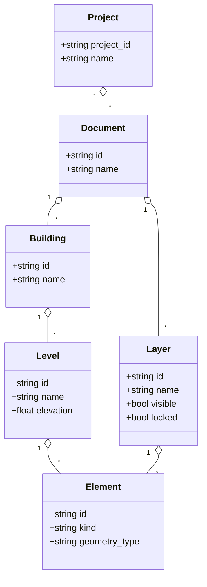

# Persistence & Document Model

## 1️⃣ Scope

- CADコアの Document/Building/Level/Element/Layer 等の永続化モデルを定義する。
- v0 ではシンプルな JSON ベースを採用し、将来のフォーマット変更に備えてバージョン情報を持つ。

## 2️⃣ ファイル構造 (v0, JSON) — Draft Schema

トップレベルは「プロジェクト」単位のJSONとする。

```jsonc
{
  "version": "0.1.0",           // スキーマバージョン
  "project_id": "uuid",
  "name": "Project Name",
  "documents": [
    {
      "id": "doc-uuid",
      "name": "Building A",
      "buildings": [ "bld-uuid-1" ],   // ひとまず1:1想定
      "layers": [ "layer-uuid-1", "layer-uuid-2" ],
      "elements": [ "elem-uuid-1", "elem-uuid-2" ]
    }
  ],
  "buildings": [
    {
      "id": "bld-uuid-1",
      "name": "Main Building",
      "levels": [ "lvl-uuid-1", "lvl-uuid-2" ]
    }
  ],
  "levels": [
    {
      "id": "lvl-uuid-1",
      "name": "1F",
      "elevation": 0.0
    }
  ],
  "layers": [
    {
      "id": "layer-uuid-1",
      "name": "0",
      "visible": true,
      "locked": false,
      "color": { "type": "ByLayer" },      // v0ではByLayer/Explicitだけ
      "linetype": { "type": "ByLayer" },
      "lineweight": { "type": "ByLayer" }
    }
  ],
  "elements": [
    {
      "id": "elem-uuid-1",
      "document_id": "doc-uuid",
      "building_id": "bld-uuid-1",
      "level_id": "lvl-uuid-1",
      "layer_id": "layer-uuid-1",
      "kind": "Line",                      // Line / Polyline / Circle / Wall / Column etc.
      "transform": {
        "matrix": [/* 4x4 row-major or col-major, schemaで定義 */]
      },
      "geometry": {
        "type": "Line2D",
        "start": [0.0, 0.0],
        "end": [1.0, 0.0]
      },
      "props": {
        "color": { "type": "ByLayer" },    // or { "type": "Explicit", "value": "#RRGGBB" }
        "linetype": { "type": "ByLayer" },
        "lineweight": { "type": "ByLayer" }
      }
    }
  ]
}
```

ポイント:
- Elementはフラットな配列とし、`document_id/building_id/level_id/layer_id` で所属を参照する（深いネストを避ける）。
- `geometry` は v0では2D drafter想定の簡易構造（Line2D/Polyline2D/…）から開始し、将来BRep/CSGを拡張フィールドとして追加する。
- Transformは4x4行列で保存し、ワールド座標系で扱う（単位はメートル前提とする）。

### kind と geometry.type の役割分担
- `kind`: 意味的なエンティティ種別（例: `"Line"`, `"Polyline"`, `"Wall"`, `"Column"`）。CADコアやUIロジックが「何の要素か」を判断するために使う。
- `geometry.type`: 形状表現の種別（例: `"Line2D"`, `"Polyline2D"`, `"Arc2D"`）。描画やジオメトリ計算のための具体的な表現。
- 例: 壁要素は `kind="Wall"`, `geometry.type="Polyline2D"` のように、「意味」と「形状表現」を分離する設計とする。



## 3️⃣ ID の永続化

- DocumentId/BuildingId/LevelId/LayerId/ElementId など、論理IDはファイルに保存し、再読み込み時に復元する。
- ID は原則再利用しない（削除後に同じIDを新規発行しない）。
- Undo/Redo の履歴は v0 では永続化しない（セッション単位とする）。

### EntityId / GPUインデックスとの関係
- 永続化されるID（DocumentId/ElementId/LayerId 等）は UUID などの安定IDとし、SceneContext 内部での GPUリソースインデックスとは無関係とする。
- SceneContext は内部で別途インデックスやハンドルを管理してよいが、永続IDと混同しない。

## 4️⃣ バージョニングと互換性

- ファイルの `version` フィールドでスキーマのバージョンを管理する。
- v0 系は開発中のため破壊的変更を許容し、メジャー版安定後に互換性ポリシーを定義する。

### 座標系・単位
- ワールド座標系は右手系とし、単位はメートル (m) を前提とする。
- 2D ドラフティングビューでは `(x, y)` を水平/垂直平面上のメートル座標とみなす。

## 5️⃣ SceneContext / Rendering との関係

- 永続化対象は CADコアの論理モデルのみ。
- SceneContext/SceneWorld の状態（バッファやEntityId等）は保存しない。
- 再ロード時には、CADコアのデータから SceneContext を再構築する（KernelShape + submit_shape など）。

<script src="https://unpkg.com/mermaid@9/dist/mermaid.min.js"></script>
<script>
  if (window.mermaid) {
    mermaid.initialize({ startOnLoad: true });
  }
</script>
